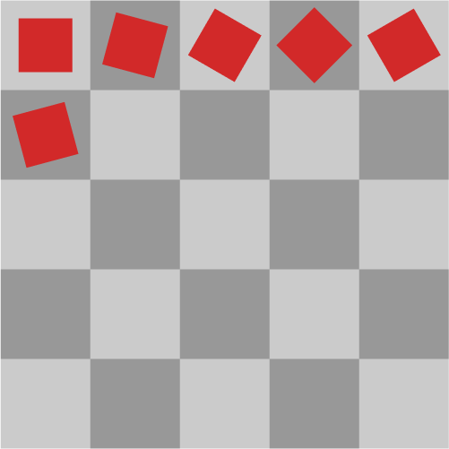

# Animation

Animation (Animator) is a tool, which allows animations to be played from spritesheets or from a collection of images easily.

## Properties

<hr>

### Tools

Tools are utility functions, which aid in defining animation frames. Tools are mainly used in conjuction with `:AddSpritesheet()`

<b>List of all available events</b>

!!! warning "Name changes"

    In the upcoming updates, it is possible for the listed tools to change names. Currently the names of these functions do not make sense at all.


| Name:             | Description: |
| ----------------- | ------------ |
| PopulateRow       | Fills a table with `x` amount of ones(1)             |
| PopulateColumn    | Fills `x` amount of tables with `y` amount of ones(1)             |

<br>

### Class properties

| Name:                 | Description:                  |
| --------------------- | ----------------------------- |
| Framerate             | The framerate of the animation
| Frame                 | Current frame
| MaxFrames             | How many frames are there in the animation
| CurrentAnimation      | The current animation's name
| Running               | Is animation being played with `:Play()`
| Objects               | Array of attached objects

## API

<hr>

### .new(`objects`)

<span style="color:rgba(197, 148, 197, 1);">@class</span>

<span style="color:rgba(197, 148, 197, 1);">@param {array} objects - [OPTIONAL] Objects to be attached (ImageLabel, ImageButton)</span>

Constructs a new Animator class. If `objects` argument is present it will automatically attach those objects.

<br>

### :AddSpritesheet(`imageId`, `size`, `animations`)

<span style="color:rgba(197, 148, 197, 1);">@param {string | number} imageId - The id of the spritesheet image</span>

<span style="color:rgba(197, 148, 197, 1);">@param {vector2} size - The size of one animation frame</span>

<span style="color:rgba(197, 148, 197, 1);">@param {dictionary} animations</span>

Adds animations with the help of spritesheets.

??? hint "Example"

    ```lua
    local Animator = require(Rethink.Animation)
    local myAnimation = Animator.new()

    myAnimation:AddSpritesheet(SPRITESHEET_ID, ANIMATION_CELL_SIZE, {
        ["run"] = {
            { 1, 1, 1, 1, 1 },
        },
    })
    ```

A new animation can be created by adding a new key value paired table. The key of the table should be the name of the animation, and the value should be a set of ones(1) and zeros(0) to indicate, which represent each frame on your spritesheet.



Steps to create your animation:

1. Count how many squares are in a row and a column
2. In our animation table create as many tables as rows and inside them as many zeros(0) as columns
3. Replace the zeros(0) with ones(1) which are desired to be the part of the animation

<br>
<br>

Results:

```lua
myAnimation:AddSpritesheet(SPRITESHEET_ID, ANIMATION_CELL_SIZE, {
    ["rotating_squares"] = {
        { 1, 1, 1, 1, 1 },
        { 1, 0, 0, 0, 0 },
        { 0, 0, 0, 0, 0 },
        { 0, 0, 0, 0, 0 },
        { 0, 0, 0, 0, 0 },
    },
})
```

<br>

Tables containing no ones(1) are not required and can be left out. In case the animation is not connected and there is space between them:

1. Using r

    `r` is an offset value, which can be inserted into animation tables having gaps in them. When Animator reads and maps out the animations it will use the r's value to offset the frame.

    Normally this represents the 1st row but since there's an `r` key
    Animator will offset it by that amount. In our case this will represent the 3rd row, instead of the 1st row.

    ```lua
    myAnimation:AddSpritesheet(SPRITESHEET_ID, ANIMATION_CELL_SIZE, {
        ["rotating_squares"] = {
            { r = 3, 1, 1, 0, 0, 0 },
        },
    })
    ```

2. Filling out gaps

    Filling out the empty gaps with animation tables contaizing zeros(0) work as well. However, for larger spritesheets, using `r` is the recommended option.

    ```lua
    myAnimation:AddSpritesheet(SPRITESHEET_ID, ANIMATION_CELL_SIZE, {
        ["rotating_squares"] = {
            { 0, 0, 0, 0, 0 },
            { 0, 0, 0, 0, 0 },
            { 1, 1, 0, 0, 0 },
        },
    })
    ```

<br>

### :AddCollection(`collection`)

<span style="color:rgba(197, 148, 197, 1);">@param {dictionary} collection</span>

Adds a collection of images as animations. The structure of the `collection` table matches the one used in `:AddSpritesheet` method. However, instead of tables containing a set of zeros(0) and ones(1) the images' ids are used.

??? hint "Example"

    ```lua
    local Animator = require(Rethink.Animation)
    local myAnimation = Animator.new()

    myAnimation:AddCollection({
        ["example"] = {
            IMAGE_ID_1,
            IMAGE_ID_2,
            IMAGE_ID_3
        },
    })
    ```

<br>

### :Play()

<span style="color:rgba(197, 148, 197, 1);">@return {Promise}</span>

Plays the selected animation independant from framerate infinitely.

<br>

### :Stop()

Haults the animation, which was started by `:Play()`

<br>

### :SetFramerate(`framerate`)

<span style="color:rgba(197, 148, 197, 1);">@param {number} framerate</span>

<span style="color:rgba(197, 148, 197, 1);">@default {framerate} 60</span>

Sets the framerate of the animations, default value is 60 FPS.

<br>

### :NextFrame()

Advances to the next frame in the selected animation.

<br>

### :PreviousFrame()

Advances to the previous frame in the selected animation.

<br>

### :AttachObject(`object`)

<span style="color:rgba(197, 148, 197, 1);">@param {imagelabel | imagebutton} object</span>

Attaches the provided object to Animator, which will display the current animation frame.

<br>

### :DetachObject(`object`)

<span style="color:rgba(197, 148, 197, 1);">@param {imagelabel | imagebutton} object</span>

Detaches the provided obhect from Animator and will no longer display the current animation frame.

### :ChangeAnimation(`animationName`)

<span style="color:rgba(197, 148, 197, 1);">@param {string} animationName</span>

Changes the animation being played. If Animator cannot find the specified animation it will throw an error.

<br>

### :ClearAnimationData()

Clears all the data associated with animations. This includes objects as well.

<br>

### :GetCurrentAnimation()

<span style="color:rgba(197, 148, 197, 1);">@return {number}</span>

Returns the current animation that Animator uses.

<br>

### :GetCurrentFrame

<span style="color:rgba(197, 148, 197, 1);">@return {number}</span>

Returns the current frame the animation is on.

<br>

### :GetFramerate

<span style="color:rgba(197, 148, 197, 1);">@return {number}</span>

Returns the framerate.

<br>

### :GetMaxFrames

<span style="color:rgba(197, 148, 197, 1);">@return {number}</span>

Returns the maximum frames in the animation.

<br>

### :GetObjects

<span style="color:rgba(197, 148, 197, 1);">@return {array}</span>

Returns all of the attached objects.

<br>

### :Destroy

<span style="color:rgba(197, 148, 197, 1);">@destructor</span>

Destroys the current Animator class.